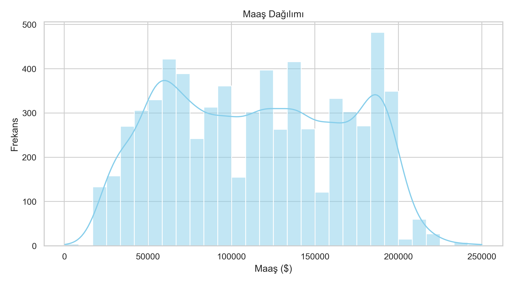
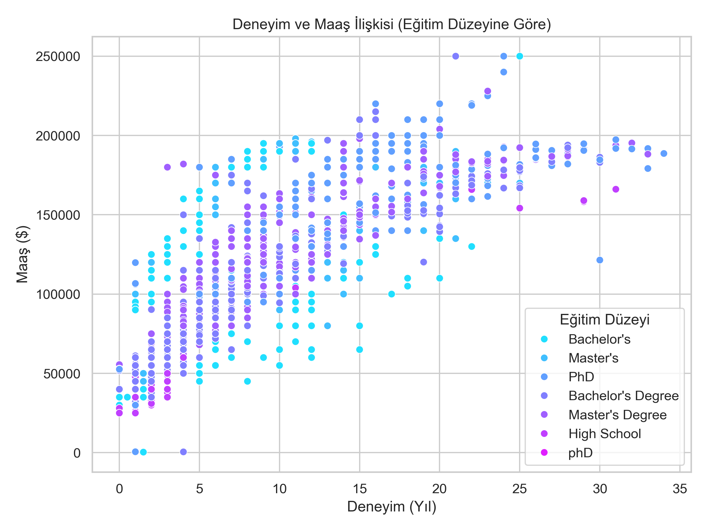
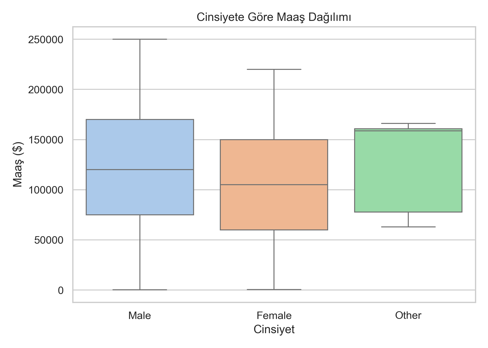
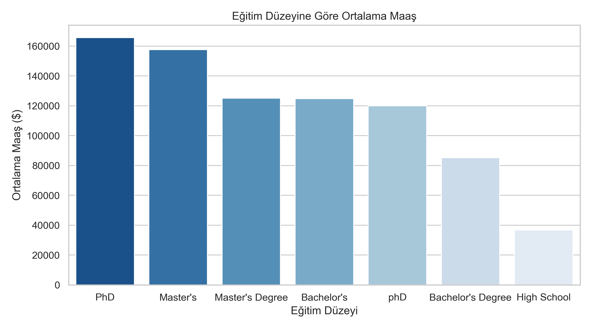
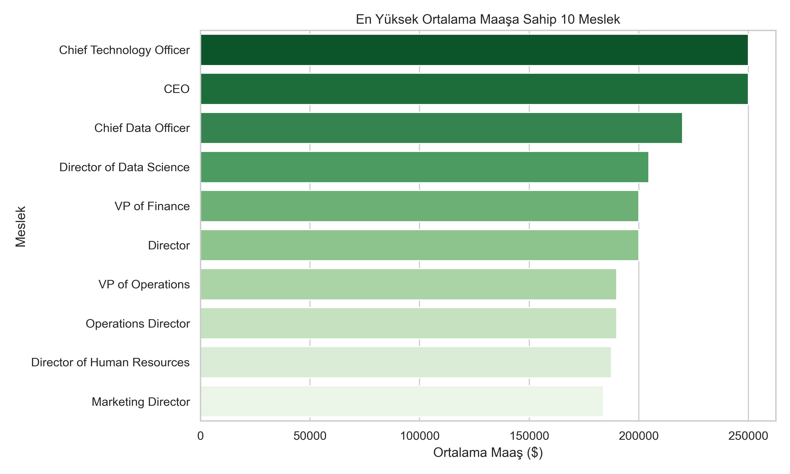
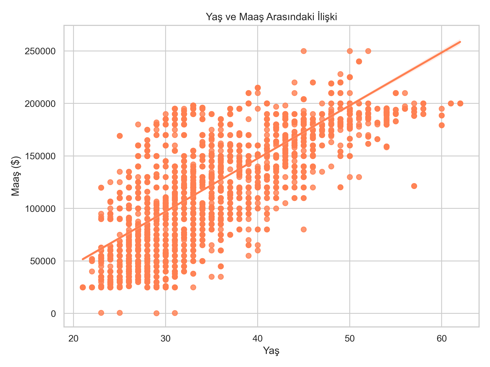
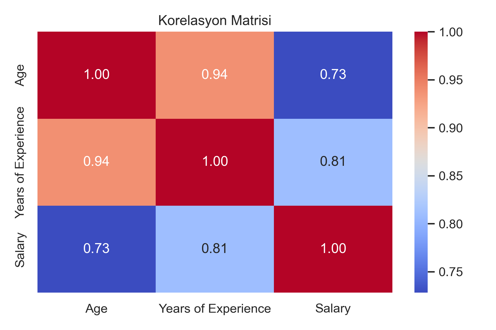

## Salary Insights – Deneyim ve Eğitim Analizi

İş Deneyimi, Eğitim ve Maaş Analizi Projesi

## Örnek Grafikler

Tüm grafikler outputs/figures/ klasörüne kaydedilmiştir.

| Grafik | Önizleme |
|--------|----------|
| maas_dagilimi.png |  |
| deneyim_maas_iliskisi.png |  |
| cinsiyet_maas.png |  |
| egitim_maas.png |  |
| top10_meslek.png |  |
| yas_maas_iliskisi.png |  |
| korelasyon_matrisi.png |  |

## Proje Hakkında

Bu proje, çalışanların yaş, cinsiyet, eğitim seviyesi, iş unvanı ve deneyim yılına göre maaş ilişkilerini analiz etmek için hazırlanmıştır.
Python veri analizi kütüphaneleri (Pandas, NumPy, Seaborn, Matplotlib) kullanılmıştır.
Amaç, maaşı etkileyen temel faktörleri belirlemek ve görselleştirmelerle desteklenmiş içgörüler üretmektir.

## Kullanılan Teknolojiler

-Python 3

-Pandas – Veri temizleme ve ön işleme

-NumPy – İstatistiksel hesaplamalar ve korelasyon

-Seaborn – Yüksek seviyeli görselleştirme

-Matplotlib – Grafik özelleştirme ve kaydetme

## Veri Seti

Dosya: Salary_Data.csv

Sütun	Açıklama
Age	Çalışanın yaşı
Gender	Cinsiyet
Education Level	Eğitim düzeyi
Job Title	İş unvanı
Years of Experience	Deneyim yılı
Salary	Maaş (USD)

## Analiz Adımları

## Veri Temizleme

-Eksik veriler kaldırıldı (dropna)

-Sayısal veriler için tür dönüşümü yapıldı (astype)

## İstatistiksel Analiz

-Ortalama, medyan, minimum ve maksimum maaş hesaplandı

-Deneyim, yaş ve maaş arasındaki korelasyon analiz edildi

## Görselleştirme

-Maaş dağılımı (Histogram)

-Deneyim-Maaş ilişkisi (Scatterplot)

-Cinsiyete göre maaş farkı (Boxplot)

-Eğitim düzeyine göre ortalama maaş (Bar chart)

-En yüksek maaşlı meslekler (Top 10 bar chart)

-Yaş-Maaş ilişkisi (Regression plot)

-Korelasyon matrisi (Heatmap)

## Çıktı & İçgörüler

-Ortalama maaş deneyimle birlikte artmaktadır.

-Eğitim düzeyi yüksek olanlar daha yüksek maaş almaktadır.

-Cinsiyet bazında küçük maaş farklılıkları gözlemlenmiştir.

-En yüksek ortalama maaş genellikle Senior Data Scientist gibi teknik pozisyonlardadır.

## Proje Dosyaları

Salary Insights – Deneyim ve Eğitim Analizi/
│
├── kod.py
├── Salary_Data.csv
├── outputs/
│ └── figures/
│ ├── maas_dagilimi.png
│ ├── deneyim_maas_iliskisi.png
│ ├── cinsiyet_maas.png
│ ├── egitim_maas.png
│ ├── top10_meslek.png
│ ├── yas_maas_iliskisi.png
│ └── korelasyon_matrisi.png

## Salary Insights – Experience & Education Analysis

Job Experience, Education & Salary Analysis Project

Sample Visuals

All plots are saved in the outputs/figures/ folder.

| plot | preview|
|--------|----------|
| maas_dagilimi.png |  |
| deneyim_maas_iliskisi.png |  |
| cinsiyet_maas.png |  |
| egitim_maas.png |  |
| top10_meslek.png |  |
| yas_maas_iliskisi.png |  |
| korelasyon_matrisi.png |  |

## About the Project

This project analyzes salary patterns based on employee age, gender, education level, job title, and years of experience.
Python data analysis libraries (Pandas, NumPy, Seaborn, Matplotlib) were used to identify key salary drivers and provide insights with visualizations.

## Technologies Used

-Python 3

-Pandas – Data cleaning & preprocessing

-NumPy – Statistical calculations & correlation

-Seaborn – High-level data visualization

-Matplotlib – Plot customization and saving

## Dataset

File: Salary_Data.csv

Column	Description
Age	Employee age
Gender	Gender
Education Level	Level of education
Job Title	Job title
Years of Experience	Years of experience
Salary	Salary (USD)

## Analysis Steps

## Data Cleaning

Removed missing values (dropna)

Converted numeric data types (astype)

## Statistical Overview

Calculated mean, median, minimum, and maximum salary

Analyzed correlation between experience, age, and salary

## Visualization

Salary distribution (Histogram)

Experience vs Salary (Scatterplot)

Salary differences by Gender (Boxplot)

Average Salary by Education Level (Bar chart)

Top 10 highest-paying jobs (Bar chart)

Age vs Salary (Regression plot)

Correlation Matrix (Heatmap)

## Key Insights

Average salary increases with experience.

Employees with higher education earn higher salaries.

Minor salary differences exist based on gender.

Highest average salaries are usually in technical positions like Senior Data Scientist.

## Project Structure

## Salary Insights – Experience & Education Analysis/
│
├── code.py
├── Salary_Data.csv
├── outputs/
│ └── figures/
│ ├── maas_dagilimi.png
│ ├── deneyim_maas_iliskisi.png
│ ├── cinsiyet_maas.png
│ ├── egitim_maas.png
│ ├── top10_meslek.png
│ ├── yas_maas_iliskisi.png
│ └── korelasyon_matrisi.png

